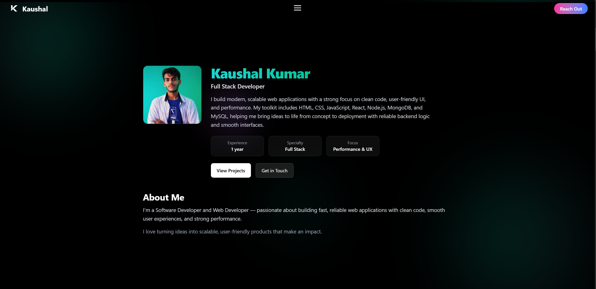
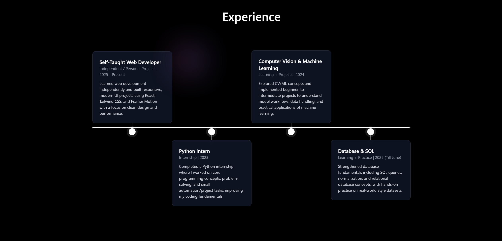
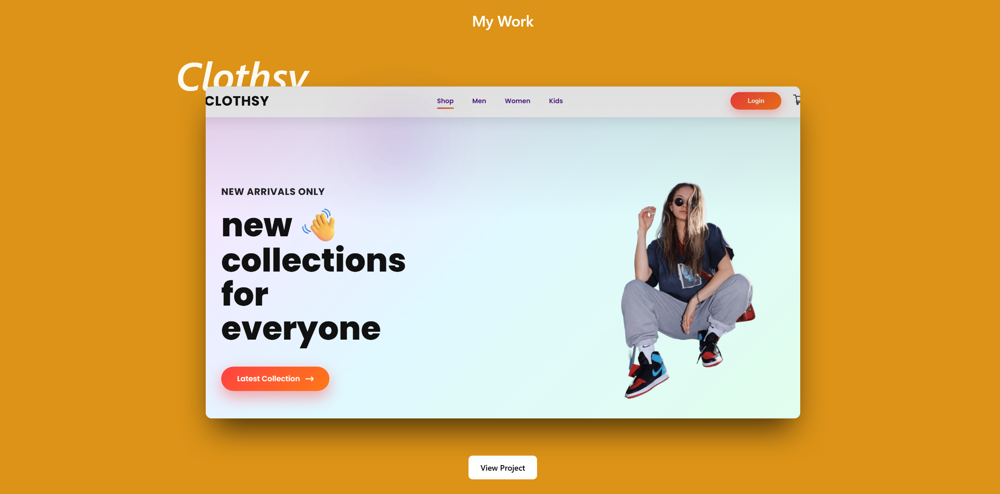
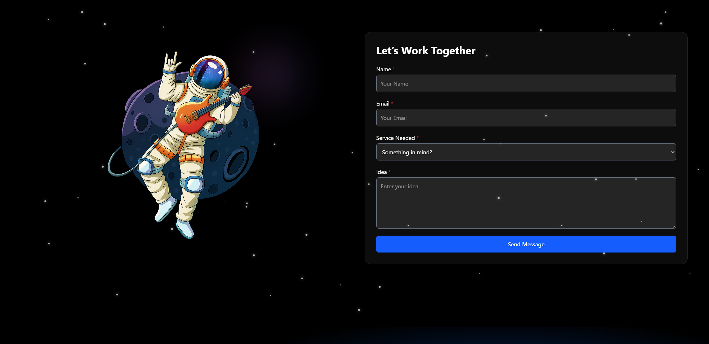

# 🚀 Developer Portfolio Website

<div align="center">


**A modern, fully responsive developer portfolio built with cutting-edge technologies**

[Features](#-features) • [Demo](#-live-demo) • [Installation](#️-installation--setup) • [Customization](#-customization-guide) • [Deployment](#-deployment)

</div>

---

## 📋 Table of Contents

- [Overview](#-overview)
- [Screenshots](#-screenshots)
- [Features](#-features)
- [Tech Stack](#️-tech-stack)
- [Project Structure](#-project-structure)
- [Installation & Setup](#️-installation--setup)
- [Customization Guide](#-customization-guide)
- [Build & Deployment](#-build--deployment)
- [Custom Domain](#-custom-domain-setup)
- [License](#-license)
- [Author](#-author)

## 📖 Overview

A stunning, modern developer portfolio website built with React, Vite, Tailwind CSS, and Framer Motion. This portfolio features smooth animations, a clean user interface, and is fully responsive across all devices. Perfect for developers looking to showcase their skills, projects, and experience in a professional and visually appealing way.

### Key Highlights

- ⚡ **Lightning Fast**: Built with Vite for optimal performance
- 🎨 **Modern Design**: Clean, professional UI with smooth animations
- 📱 **Fully Responsive**: Works seamlessly on mobile, tablet, and desktop
- 🎭 **Interactive**: Custom cursor, particle effects, and animated sections
- 🎵 **Unique Features**: Background music player, intro animation
- 🔧 **Easy to Customize**: Well-structured, commented code
- 🚀 **Production Ready**: Optimized for deployment on Vercel/Netlify

## 📸 Screenshots

### Hero Section

*Modern landing page with 3D character, animated text, and social links*

### About & Profile Section

*Detailed profile showcase with experience metrics and call-to-action buttons*

### Experience Timeline

*Interactive timeline displaying career journey and skill development*

### Projects Showcase

*Portfolio projects displayed with preview images and technology tags*

### Contact Form

*Professional contact form with astronaut illustration and animated background*

## ✨ Features

### 🎨 Design & UI
- **Modern Aesthetic**: Dark theme with vibrant accent colors (cyan/teal)
- **Smooth Animations**: Powered by Framer Motion for fluid transitions
- **Custom Cursor**: Interactive custom cursor effect
- **Particle Background**: Dynamic animated particle system
- **Robot Character**: Eye-catching robot character in hero section

### 🧩 Components
- **Responsive Navbar**: Smooth navigation with mobile menu overlay
- **Intro Animation**: Engaging loading animation on first visit
- **Music Player**: Optional background music feature
- **Section-Based Layout**: Modular sections for easy customization
- **Contact Form**: Functional contact form with validation

### 📱 Responsiveness
- Mobile-first design approach
- Breakpoint optimization for all screen sizes
- Touch-friendly interactions
- Optimized images and assets

### ⚡ Performance
- Fast page loads with Vite
- Optimized bundle size
- Lazy loading for images
- Code splitting for better performance

## 🛠️ Tech Stack

| Technology | Purpose | Version |
|------------|---------|---------|
| **React** | Frontend framework | 18.x |
| **Vite** | Build tool & dev server | 5.x |
| **Tailwind CSS** | Utility-first CSS framework | 3.x |
| **Framer Motion** | Animation library | Latest |
| **React Router** | Client-side routing | 6.x |
| **EmailJS** | Email service integration | Latest |

### Additional Libraries
- **Particles.js** - Particle background effects
- **React Icons** - Icon library
- **React Hook Form** - Form handling
- **Howler.js** - Audio player

## 📁 Project Structure

```
portfolio/
│
├── node_modules/                # Dependencies
│
├── public/                      # Static assets
│   └── favicon.ico
│
├── screenshots/                 # Portfolio screenshots
│   ├── hero-section.png
│   ├── about-section.png
│   ├── experience-section.png
│   ├── projects-section.png
│   ├── contact-section.png
│   └── folder-structure.png
│
├── src/
│   │
│   ├── assets/                  # Images, icons, fonts
│   │   ├── images/
│   │   ├── icons/
│   │   └── fonts/
│   │
│   ├── components/              # Reusable UI components
│   │   ├── CustomCursor.jsx     # Custom animated cursor
│   │   ├── IntroAnimation.jsx   # Initial loading animation
│   │   ├── MusicPlayer.jsx      # Background music player
│   │   ├── Navbar.jsx           # Navigation bar
│   │   ├── OverlayMenu.jsx      # Mobile menu overlay
│   │   └── ParticlesBackground.jsx  # Particle effect background
│   │
│   ├── sections/                # Main page sections
│   │   ├── Home.jsx             # Hero/Landing section
│   │   ├── About.jsx            # About me section
│   │   ├── Skills.jsx           # Skills & technologies
│   │   ├── Projects.jsx         # Portfolio projects
│   │   ├── Experience.jsx       # Work experience timeline
│   │   ├── Testimonials.jsx     # Client testimonials
│   │   ├── Contact.jsx          # Contact form
│   │   └── Footer.jsx           # Footer section
│   │
│   ├── App.jsx                  # Main app component
│   ├── App.css                  # App-level styles
│   ├── main.jsx                 # Entry point
│   └── index.css                # Global styles & Tailwind config
│
├── .env                         # Environment variables (not committed)
├── .gitignore                   # Git ignore rules
├── eslint.config.js             # ESLint configuration
├── index.html                   # HTML template
├── package.json                 # Dependencies & scripts
├── package-lock.json            # Locked dependencies
├── vite.config.js               # Vite configuration
└── README.md                    # This file
```

### Key Directories Explained

| Directory | Purpose |
|-----------|---------|
| `src/components/` | Reusable UI components used across sections |
| `src/sections/` | Main content sections of the portfolio |
| `src/assets/` | Static files like images, icons, fonts |
| `screenshots/` | Portfolio screenshots for documentation |
| `public/` | Public static assets served directly |

## ⚙️ Installation & Setup

### Prerequisites

Before you begin, ensure you have:

- ✅ **Node.js** v18.x or higher ([Download](https://nodejs.org/))
- ✅ **npm** v8.x or higher (comes with Node.js)
- ✅ **Git** (optional, for version control)
- ✅ **Code Editor** (VS Code recommended)

### Step 1: Download/Clone Project

**Option A: Download ZIP**
1. Download the project ZIP file
2. Extract to your desired location
3. Open the folder in VS Code

**Option B: Clone with Git**
```bash
git clone https://github.com/your-username/portfolio.git
cd portfolio
```

### Step 2: Install Dependencies

Open terminal in VS Code and run:

```bash
npm install
```

This installs all required packages including:
- React & React DOM
- Vite
- Tailwind CSS
- Framer Motion
- All other dependencies

### Step 3: Environment Setup

Create a `.env` file in the project root:

```env
# EmailJS Configuration (for contact form)
VITE_EMAILJS_SERVICE_ID=your_service_id
VITE_EMAILJS_TEMPLATE_ID=your_template_id
VITE_EMAILJS_PUBLIC_KEY=your_public_key

# Optional: Analytics
VITE_GA_TRACKING_ID=your_ga_tracking_id
```

**Note**: Get EmailJS credentials from [emailjs.com](https://www.emailjs.com/)

### Step 4: Start Development Server

```bash
npm run dev
```

The portfolio will be available at:
```
http://localhost:5173/
```

**Development Features:**
- ⚡ Hot Module Replacement (HMR)
- 🔄 Auto-reload on file changes
- 🐛 Error overlay for debugging

### Step 5: Verify Installation

Open `http://localhost:5173/` in your browser. You should see:
- ✅ Hero section with animated text
- ✅ Navigation working
- ✅ Smooth scroll between sections
- ✅ Particle background (if enabled)

## 🎨 Customization Guide

### 1. Personal Information

#### Home Section (`src/sections/Home.jsx`)
```jsx
// Update your name and title
<h1>Hello, I'm</h1>
<h2>Kaushal Kumar</h2>
<p>Full Stack Developer</p>
```

#### About Section (`src/sections/About.jsx`)
```jsx
// Update bio and details
const personalInfo = {
  name: "Your Name",
  title: "Your Title",
  experience: "1 year",
  specialty: "Full Stack",
  focus: "Performance & UX"
};
```

### 2. Projects

Edit `src/sections/Projects.jsx`:

```jsx
const projects = [
  {
    id: 1,
    title: "Your Project Name",
    description: "Project description here",
    image: "/path/to/image.png",
    technologies: ["React", "Node.js", "MongoDB"],
    github: "https://github.com/username/repo",
    live: "https://project-demo.com"
  },
  // Add more projects...
];
```

### 3. Experience

Update `src/sections/Experience.jsx`:

```jsx
const experiences = [
  {
    title: "Your Position",
    company: "Company Name",
    period: "2025 - Present",
    description: "What you did and achieved",
    skills: ["Skill 1", "Skill 2", "Skill 3"]
  },
  // Add more experiences...
];
```

### 4. Skills & Technologies

Edit `src/sections/Skills.jsx`:

```jsx
const skills = {
  frontend: ["React", "Tailwind", "JavaScript"],
  backend: ["Node.js", "Express", "MongoDB"],
  tools: ["Git", "VS Code", "Figma"]
};
```

### 5. Theme Customization

#### Colors (`src/index.css`)
```css
:root {
  --primary: #06b6d4;      /* Cyan/Teal */
  --secondary: #8b5cf6;     /* Purple */
  --accent: #f59e0b;        /* Orange */
  --background: #0a0a0a;    /* Dark background */
  --text: #ffffff;          /* White text */
}
```

#### Fonts
Update Google Fonts in `index.html`:
```html
<link href="https://fonts.googleapis.com/css2?family=Your+Font&display=swap" rel="stylesheet">
```

Then update in `src/index.css`:
```css
body {
  font-family: 'Your Font', sans-serif;
}
```

### 6. Animations

Customize Framer Motion animations in components:

```jsx
// Example: Fade in from left
<motion.div
  initial={{ opacity: 0, x: -50 }}
  animate={{ opacity: 1, x: 0 }}
  transition={{ duration: 0.8 }}
>
  Your content here
</motion.div>
```

### 7. Contact Form

#### EmailJS Setup
1. Sign up at [emailjs.com](https://www.emailjs.com/)
2. Create email service
3. Create email template
4. Get Service ID, Template ID, and Public Key
5. Add to `.env` file

#### Form Fields (`src/sections/Contact.jsx`)
```jsx
const formFields = [
  { name: 'name', type: 'text', placeholder: 'Your Name' },
  { name: 'email', type: 'email', placeholder: 'Your Email' },
  { name: 'service', type: 'select', options: [...] },
  { name: 'message', type: 'textarea', placeholder: 'Your Message' }
];
```

### 8. Social Links

Update in `src/sections/Home.jsx` and `src/sections/Footer.jsx`:

```jsx
const socialLinks = {
  github: "https://github.com/yourusername",
  linkedin: "https://linkedin.com/in/yourprofile",
  twitter: "https://twitter.com/yourhandle",
  instagram: "https://instagram.com/yourhandle"
};
```

## 🏗️ Build & Deployment

### Build for Production

Create an optimized production build:

```bash
npm run build
```

This generates a `dist/` folder with:
- ✅ Minified JavaScript
- ✅ Optimized CSS
- ✅ Compressed assets
- ✅ Source maps

### Preview Production Build

```bash
npm run preview
```

Preview at: `http://localhost:4173/`

### Deployment Options

#### Option 1: Vercel (Recommended)

1. **Install Vercel CLI** (optional)
   ```bash
   npm i -g vercel
   ```

2. **Deploy via Dashboard**
   - Go to [vercel.com](https://vercel.com)
   - Click "Add New Project"
   - Import from GitHub or upload folder
   - Vercel auto-detects Vite settings
   - Click "Deploy"

3. **Deploy via CLI**
   ```bash
   vercel
   ```

**Vercel Configuration** (vercel.json - optional):
```json
{
  "buildCommand": "npm run build",
  "outputDirectory": "dist",
  "framework": "vite"
}
```

**Live URL**: `https://your-portfolio.vercel.app`

#### Option 2: Netlify

1. **Manual Deployment**
   - Build project: `npm run build`
   - Go to [netlify.com](https://netlify.com)
   - Drag & drop `dist/` folder

2. **GitHub Integration**
   - Click "New site from Git"
   - Connect GitHub repository
   - Build settings:
     ```
     Build command: npm run build
     Publish directory: dist
     ```
   - Click "Deploy site"

**Netlify Configuration** (netlify.toml):
```toml
[build]
  command = "npm run build"
  publish = "dist"

[[redirects]]
  from = "/*"
  to = "/index.html"
  status = 200
```

**Live URL**: `https://your-portfolio.netlify.app`

#### Option 3: GitHub Pages

1. Install gh-pages:
   ```bash
   npm install --save-dev gh-pages
   ```

2. Update `package.json`:
   ```json
   {
     "homepage": "https://yourusername.github.io/portfolio",
     "scripts": {
       "deploy": "npm run build && gh-pages -d dist"
     }
   }
   ```

3. Deploy:
   ```bash
   npm run deploy
   ```

### Deployment Checklist

- [ ] Update personal information
- [ ] Add real project images
- [ ] Configure EmailJS for contact form
- [ ] Update social media links
- [ ] Test all links and navigation
- [ ] Optimize images (<200KB each)
- [ ] Add meta tags for SEO
- [ ] Test on mobile devices
- [ ] Add Google Analytics (optional)
- [ ] Create custom domain (optional)

## 🌐 Custom Domain Setup

### Step 1: Purchase Domain

Buy from domain registrars:
- [Namecheap](https://www.namecheap.com)
- [GoDaddy](https://www.godaddy.com)
- [Google Domains](https://domains.google)
- [Hostinger](https://www.hostinger.com)

**Recommended**: `.com`, `.dev`, or `.io` domains

### Step 2: Configure DNS

#### For Vercel:
1. Go to Vercel Dashboard → Project Settings
2. Click "Domains"
3. Add your custom domain
4. Update DNS records at your registrar:
   ```
   Type: A
   Name: @
   Value: 76.76.21.21
   
   Type: CNAME
   Name: www
   Value: cname.vercel-dns.com
   ```

#### For Netlify:
1. Go to Site Settings → Domain Management
2. Add custom domain
3. Update DNS records:
   ```
   Type: A
   Name: @
   Value: 75.2.60.5
   
   Type: CNAME
   Name: www
   Value: your-site.netlify.app
   ```

### Step 3: Enable HTTPS

Both Vercel and Netlify provide free SSL certificates automatically.

**Wait time**: DNS propagation can take 24-48 hours.

## 🔧 Advanced Configuration

### Environment Variables

Create `.env` file for sensitive data:

```env
# EmailJS
VITE_EMAILJS_SERVICE_ID=service_xxxxx
VITE_EMAILJS_TEMPLATE_ID=template_xxxxx
VITE_EMAILJS_PUBLIC_KEY=xxxxx

# Analytics
VITE_GA_TRACKING_ID=G-XXXXXXXXXX

# API Keys (if needed)
VITE_API_KEY=your_api_key
```

**Important**: Never commit `.env` to GitHub!

### Vite Configuration

Customize `vite.config.js`:

```javascript
import { defineConfig } from 'vite'
import react from '@vitejs/plugin-react'

export default defineConfig({
  plugins: [react()],
  base: '/', // Change for GitHub Pages
  build: {
    outDir: 'dist',
    sourcemap: false,
    rollupOptions: {
      output: {
        manualChunks: {
          vendor: ['react', 'react-dom'],
          animations: ['framer-motion']
        }
      }
    }
  }
})
```

### SEO Optimization

Add to `index.html`:

```html
<head>
  <title>Your Name - Full Stack Developer</title>
  <meta name="description" content="Portfolio of Your Name, a Full Stack Developer specializing in React, Node.js, and modern web technologies.">
  <meta name="keywords" content="Full Stack Developer, React, Node.js, Portfolio">
  
  <!-- Open Graph -->
  <meta property="og:title" content="Your Name - Portfolio">
  <meta property="og:description" content="Full Stack Developer Portfolio">
  <meta property="og:image" content="/preview.jpg">
  <meta property="og:url" content="https://yourwebsite.com">
  
  <!-- Twitter Card -->
  <meta name="twitter:card" content="summary_large_image">
  <meta name="twitter:title" content="Your Name - Portfolio">
  <meta name="twitter:description" content="Full Stack Developer Portfolio">
  <meta name="twitter:image" content="/preview.jpg">
</head>
```

## 📊 Analytics Integration

### Google Analytics

1. Get tracking ID from [analytics.google.com](https://analytics.google.com)
2. Add to `.env`:
   ```
   VITE_GA_TRACKING_ID=G-XXXXXXXXXX
   ```
3. Install package:
   ```bash
   npm install react-ga4
   ```
4. Initialize in `src/main.jsx`:
   ```javascript
   import ReactGA from 'react-ga4'
   ReactGA.initialize(import.meta.env.VITE_GA_TRACKING_ID)
   ```

## 🐛 Troubleshooting

### Common Issues

**Issue: npm install fails**
```bash
# Solution: Clear cache and retry
npm cache clean --force
rm -rf node_modules package-lock.json
npm install
```

**Issue: Port 5173 already in use**
```bash
# Solution: Change port in vite.config.js
export default defineConfig({
  server: { port: 3000 }
})
```

**Issue: Build fails**
```bash
# Solution: Check for TypeScript errors
npm run build -- --debug
```

**Issue: Images not loading after build**
```javascript
// Solution: Use relative paths
import image from './assets/image.png'
// Instead of: 
```

## 📝 License

This project is free to use for personal portfolio purposes.

**Terms:**
- ✅ Personal use allowed
- ✅ Modification allowed
- ✅ Commercial use allowed
- ❌ Redistribution without credit not allowed

If you use this template, please give credit by:
- Keeping footer attribution
- Linking back to original repository
- Mentioning in your README

## 👨‍💻 Author

**Kaushal Kumar**  
Full Stack Developer

<div align="center">

📧 Email: kaushalkr.585@gmail.com 
🔗 LinkedIn: https://www.linkedin.com/in/kaushal-kumar-1a0370377/
🐱 GitHub: https://github.com/kaushalkr585-cmd/

</div>

### My Projects

- 🛒 [CLOTHSY E-Commerce](https://github.com/kaushalkr585-cmd/Ecommerce-Website-HTML-CSS-JS-REACT-NODE-EXPRESS-MONGODB) - Full-stack e-commerce platform
- 🤖 [AI Attendance System](https://github.com/kaushalkr585-cmd/Automated-Attendance-System-Python-) - Face recognition attendance system
- 💬 [AI Chatbot](https://github.com/kaushalkr585-cmd/Chatbot-HTML-CSS-REACT-JS) - Google Gemini powered chatbot

## 🙏 Acknowledgments

- **Framer Motion** for animation library
- **Tailwind CSS** for styling framework
- **Vite** for blazing fast build tool
- **React** for UI framework
- **Community** for inspiration and feedback

---

<div align="center">

**Built with ❤️ using React + Vite + Tailwind CSS + Framer Motion**

⭐ If you found this helpful, please give it a star!

Made by [Kaushal Kumar](https://github.com/kaushalkr585-cmd)

[⬆ Back to Top](#-developer-portfolio-website)

</div>